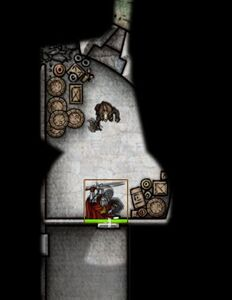
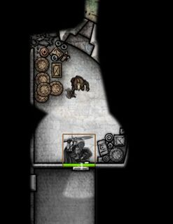
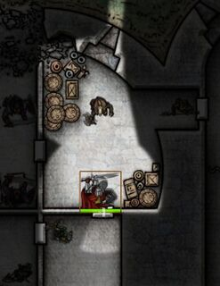
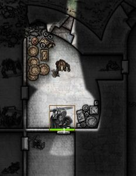
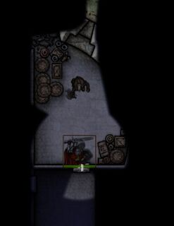
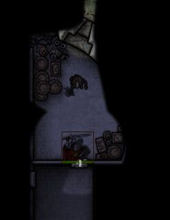
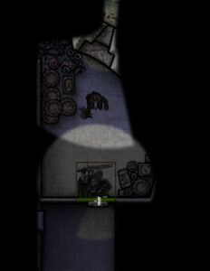
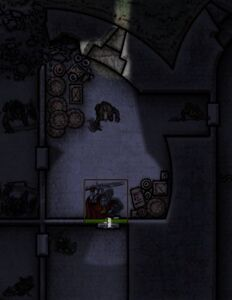
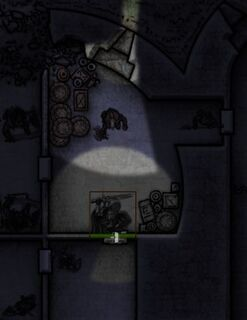

# Less Fog

Module to enhance visibility for the GM and Players in Foundry VTT.  

## Darkness Levels

The module allows you to adjust the following global lighting settings:

- Daylight Color
- Darkness Color
- Darkness of Dim Light (from daylight color to darkness color)
- Darkness of Explored Areas (from white to black)
- Darkness of Unexplored Areas (from white to black)

Here is a comparison of the defaults in Foundry to the default settings in Less Fog:

|Setting   |Foundry Default|Less Fog Default|
|:--------:|:-------------:|:--------------:|
|Daylight  |0xEEEEEE       |0xEEEEEE        |
|Darkness  |0x242448       |0x484864        |
|Dim       |0.5            |1.0             |
|Explored  |0.5            |0.4             |
|Unexplored|1.0            |0.8             |

With Less Fog, you can adjust these settings further to suit your preferences.

The first four lighting settings affect all users, both GM and Players. By default, the setting for Unexplored areas only affects the display for the GM, preserving full blackout of these areas for Players. For the GM, Less Fog will also automatically lighten the Unexplored areas to compensate for the effect of increasing Darkness levels in a scene.  So you should no longer have to adjust the Unexplored setting when switching between day and night scenes.

## Reveal Tokens

By default, Foundry hides all tokens that are outside a selected token's field of view. This is true for both Players and the GM. So when the GM selects a token on the map, only the tokens that can be seen by the selected token are displayed.  To make things easier on the GM, Less Fog has an option to reveal *to the GM only* all tokens on the map.

## Player Vision

In response to requests from folks playing games like Lancer, there is now an option to reveal to the Players the Unexplored areas and all tokens on the map. With this option enabled, a Player will now see the same thing that the GM would see if the GM were to select that Player's token. This option is disabled by default, since it is generally not desirable in most games to reveal to the Players those tokens and areas covered by FOW. But this option can be enabled for those games where you want your Players to see the whole map and all the tokens on it, while using the FOW to indicate the actual extent of a token's line of sight.

## GM Vision

*For the GM only*, the module also adds a button to the Token controls on the left side of the screen that will toggle the entire FOW on and off. This button replicates a similar function that appeared in older versions (before 2.6.1) of the [Furnace module](https://github.com/League-of-Foundry-Developers/fvtt-module-furnace).

## Illustrating the Effect of Less Fog and Perfect Vision

Less Fog works well in combination with the [Perfect Vision module](https://github.com/dev7355608/perfect-vision). This example scene with a variety of lighting and vision conditions was used to illustrate the effect of Less Fog and Perfect Vision on GM and Player views in both Day and Night settings.

Below is a side-by-side comparison of this example scene using (1) Foundry with no modules, (2) the Less Fog module, and (3) both the Less Fog and Perfect Vision modules. For the GM, Less Fog lightens the Unexplored areas and reveals all tokens on the map. For Players, Less Fog's default settings make Explored areas lighter and Dim areas darker. Adding Perfect Vision (with the dnd5e preset) renders dim vision in unlit areas in monochrome, and dim vision in dim light as bright light. While not illustrated here, Perfect Vision will use the the Daylight Color and Darkness Color set by Less Fog as its defaults, but can also override these colors for each scene if desired.

<table>
    <tr align="center">
        <th>Darkness</th>
        <th>Viewer</th>
        <th>Default</th>
        <th>Less Fog</th>
        <th>Less Fog + Perfect Vision</th>
    </tr>
    <tr align="center">
        <td rowspan="2">0.0</td>
        <td>Player</td>
        <td></td>
        <td></td>
        <td></td>
    </tr>
    <tr align="center">
        <td>GM</td>
        <td></td>
        <td></td>
        <td></td>
    </tr>
    <tr align="center">
        <td rowspan="2">1.0</td>
        <td>Player</td>
        <td></td>
        <td></td>
        <td></td>
    </tr>
    <tr align="center">
        <td>GM</td>
        <td></td>
        <td></td>
        <td></td>
    </tr>
</table>

## License

This Foundry VTT module, written by trdischat with major assistance from Calego and KaKaRoTo, is licensed under a [Creative Commons Attribution 4.0 International License](http://creativecommons.org/licenses/by/4.0/).
