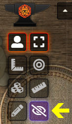

# Less Fog

Module to enhance visibility for the GM and Players in Foundry VTT.  Module options are described below.

## Fog Opacity

By default, the unexplored areas of the canvas are fully obscured by the fog of war (FOW).  This slider makes the FOW layer partially transparent, allowing the GM to see the entire map, while still indicating which portion of the map has not yet been revealed to the Players.  The color of the FOW is now a user-configurable setting in Foundry VTT and is therefore no longer needed in this module.

## Reveal Tokens

Foundry ordinarily hides all tokens that are outside a selected token's field of view. This is true for both Players and the GM. So when the GM selects a token on the map, only the tokens that can be seen by the selected token are displayed. To make things easier on the GM, Less Fog has an option to reveal *to the GM only* all tokens on the map. If the [Levels module](https://github.com/theripper93/Levels) is enabled, this option will be suppressed so that it does not conflict with the special level effects in that module.

## Reveal to All Players

In response to requests from folks playing games like Lancer, there is now an option to reveal to the Players the Unexplored areas and all tokens on the map. With this option enabled, a Player will now see the same thing that the GM would see if the GM were to select that Player's token. This option is disabled by default, since it is generally not desirable in most games to reveal to the Players those tokens and areas covered by FOW. But this option can be enabled for those games where you want your Players to see the whole map and all the tokens on it, while using the FOW to indicate the actual extent of a token's line of sight.

## GM Vision

*For the GM only*, the module also adds a button to the Token controls on the left side of the screen that will toggle the entire FOW on and off.

The Pathfinder 2e game system already has a button with a similar function. Therefore, the GM Vision button in this module will not appear when using the PF2e system.

## Older Versions of the Module

Click [here](README_Pre_v10.md) for instructions on using this module with versions of Foundry VTT *before version 10*.

## License

This Foundry VTT module, written by trdischat with major assistance from Calego and KaKaRoTo, is licensed under a [Creative Commons Attribution 4.0 International License](http://creativecommons.org/licenses/by/4.0/).
