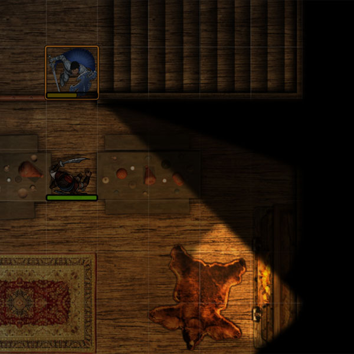
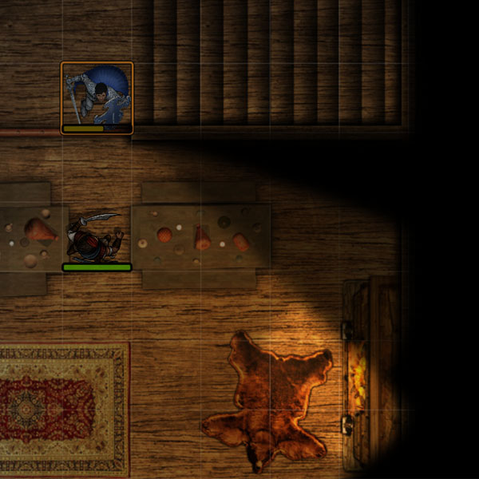
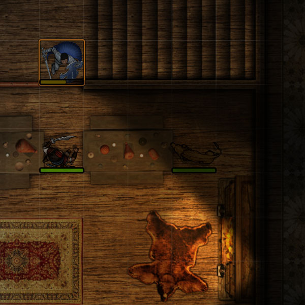

# Less Fog
Module to enhance visibility for the GM and players in Foundry VTT.  Below is the default view in FVTT, showing bright, dim, explored, and unexpored areas **without** the `lessfog` module.

The `lessfog` module tweaks the light levels and shadow blur in the player view below.

In the GM view below, the `lessfog` module reveals (to the GM only) any unexplored areas, as well as tokens anywhere on the canvas.

# Installation
See https://github.com/foundry-vtt-community/wiki/wiki/Modules#installing-modules. Open the Add-on Modules tab in the Configuration and Setup dialog. Click Install Module, paste `https://raw.githubusercontent.com/trdischat/lessfog/master/module.json` in as the Manifest URL, then click Install.

As DM go to the `Manage Modules` options menu in the Game Settings for your World, then enable the `Gamemaster FOW` module.

This module requires FVTT version 0.5.1 or later.

# License
This Foundry VTT module, writen by trdischat with major assistance from KaKaRoTo, is licensed under a [Creative Commons Attribution 4.0 International License](http://creativecommons.org/licenses/by/4.0/).

This work is licensed under Foundry Virtual Tabletop [EULA - Limited License Agreement for module development v 0.1.6](http://foundryvtt.com/pages/license.html).
